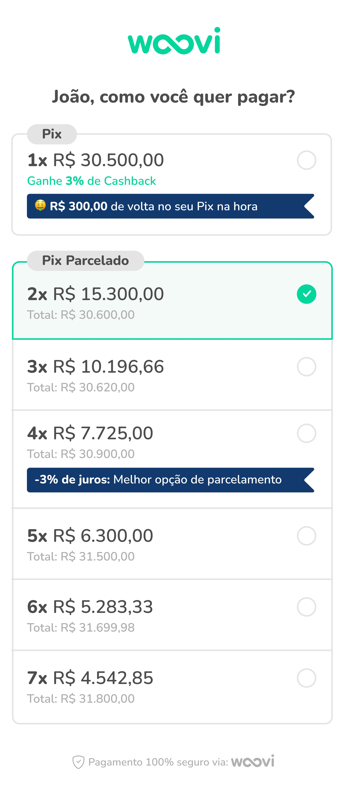
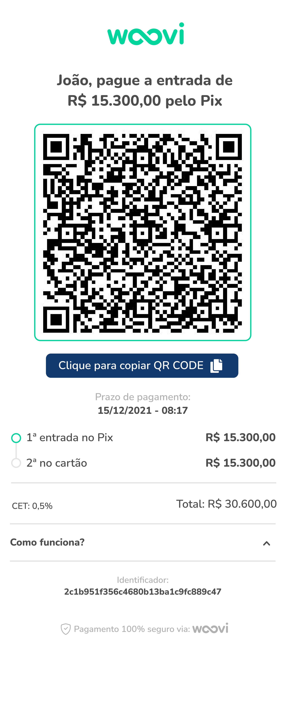
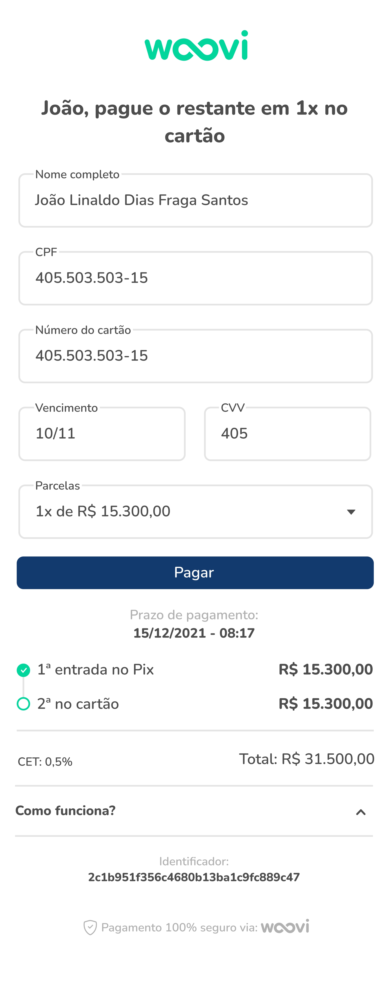

# Desafio frontend Woovi

Esse repositório é um desafio proposto para uma vaga na [Woovi](https://github.com/woovibr)
<br>
O projeto está em deploy e disponível para testes [aqui](https://woovi.hugogaia.com)
<br>
Video mostrando [aqui](https://youtu.be/llZuSzi2gOU)
## Proposta

Reproduzir 3 views apresentadas em um design do figma:





## Requisitos e recomendações
- React
- Mobile First
- Usar uma lib UI, de preferência MUI que é usada por eles
- Considerar edge cases
- CSS in Js

## Minhas escolhas

### create-react-app
Sim, mesmo no [site do react](https://react.dev/learn/start-a-new-react-project) eles recomendam usar um framework. Mas
por serem apenas 3 telas (que se tornaram 6: 3 solicitadas, uma inicial, uma final e uma de erro) resolvi usar o react 
puro com react router dom.

### CSS in Js
Minha escolha seria tailwind por ser o que estou acostumano nos ultimos tempos, mas foi divertido lembrar como o código fica 
mais limpo sem todas aquelas classes do tw em cada arquivo que abria. Claramente respeitando também a recomendação da
empresa, já que MUI é a lib que usam e adianta muito o trabalho.

### Contexts e storage
Hoje não vemos mais aquele tanto de estado sendo passado de pai pra filho em todo singular arquivo do projeto; Contexts
são minha parte favorita do react. Aqui não seria diferente: para armazenar as escolhas, nome, etapa do processo de 
pagamento, enfim, uso contextos para armazenar esses estados em conjunto com o local storage. Afinal, o user pode
recarregar a página sem querer, mil coisas podem acontecer e por conta disso todo o contexto é resetado. Em um ambiente de produção
definitivamente usaria cookies para maior segurança.

### Interpretações
São apenas 3 telas feitas no figma, por mais que já é quase todo o caminho andado, ainda falta pensar nas interações,
entender o design, ver se pode ser melhorado.
<br>
Interpretar essas telas levam aos resultados diversos que cada participante
do desafio alcançou. Pelo discord disponibilizado pela woovi, foi interessante ver a galera compartilhando seus repositórios,
alguns até vídeo gravaram, ver o que cada um pensou e interpretou.
<br>
- Eu também tive as minhas. Por exemplo, adicionei um botão para confirmar a escolha da parcela, como não tinha no figma, 
não acho interessante clicar na parcela e ir pro próximo passo, ou ter que clicar em um modal confirmando a escolha.
- Na segunda tela também entendi algumas coisas seriam boas escolhas, como remover o stepper (aquelas bolinhas de entrada no pix e cartão) caso 
o pagamento seja à vista. Nessa memsa tela, ainda falando sobre pagamento à vista, o usuário não precisa ver aquele 'CET',
já que é uma taxa de cartão de crédito que não vai ser aplicada.
- Na terceira e ultima tela, fiz duas escolhas diferentes do design original. A primeira é o select de parcelas, não acho
que faria sentido o usuário poder mudar essa opção, afinal ele já escolheu no início, então, por que mudar? Desativei o campo.
A segunda mudança é no texto do stepper. Removi os número, entendo que os steppers já deixam claro que são etapas, e aproveitei
para reforçar mais uma vez a escolha do usuário, na minha solução o texto é "restante no cartão em X vezes", apoós isso valor total.


### Dificuldades
Meu maior inimigo nessa jornada foi a parte do texto destacado em azul nas parcelas. Não consegui deixar reponsivo aquele corte
na div, o que deixa um pouco estranho quando quebra linha na responsividade, fica desproporcional e estranho. Quando não tem quebra
de linha, está perfeito. Usuários com viewport pequena me desculpem, mas eu fui derrotado nessa parte.


# Rodando o projeto
Nada fora do padrão, só clonar o projeto, instalar os pactoes com seu gerenciador de preferência e rodar com o script start.
Eu uso yarn, então:
```
git clone https://github.com/gaia-j/woovi-challenge
cd woovi-challenge
yarn
yarn start
```

## Deploy
O projeto está disponível para testes [aqui](https://woovi.hugogaia.com)


## Obrigado
Se leu tudo, muito obrigado pela atenção. Críticas são mais que bem vindas.

